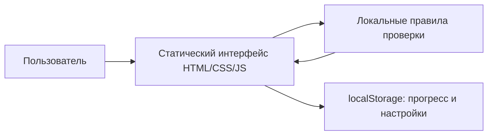
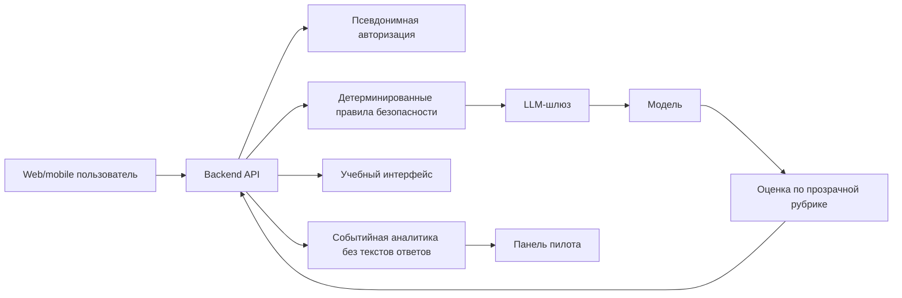

# Архитектура PilotLab

## Текущий публичный MVP

Реализовано:

- две миссии в браузере;
- локальная проверка ответа;
- подсказки, повтор и ветка восстановления;
- XP и личный прогресс;
- отсутствие внешних сетевых запросов.

Не реализовано:

- LLM и серверная логика;
- учётные записи;
- удалённое хранение;
- загрузка файлов;
- многопользовательская аналитика;
- кабинет куратора.

## Целевая архитектура пилота

## Принципы

1. **Privacy by default.** Не собирать текст, если для метрики достаточно события.
2. **Детерминированные ограничения до LLM.** Секреты, контакты и опасные категории проверяются отдельным слоем.
3. **LLM не принимает критическое решение.** Она объясняет, задаёт вопрос или предлагает черновик.
4. **Проверяемая обратная связь.** Оценка связывается с видимой пользователю рубрикой.
5. **Безопасная деградация.** При недоступности модели пользователь получает резервный сценарий, а не пустой экран.
6. **Наблюдаемость без слежки.** События описывают прохождение, но не содержат ФИО и исходные пользовательские тексты.

## События будущего пилота

Минимальный набор:

- `mission_started`;
- `attempt_submitted`;
- `hint_opened` с уровнем;
- `recovery_opened` с категорией;
- `safety_stop_triggered` без исходного текста;
- `mission_completed`;
- `transfer_case_completed`;
- `session_ended`.

Перед production-запуском потребуется отдельная модель угроз, политика хранения, договоры с обработчиками данных, нагрузочное тестирование и ручной red-team сценариев LLM.
